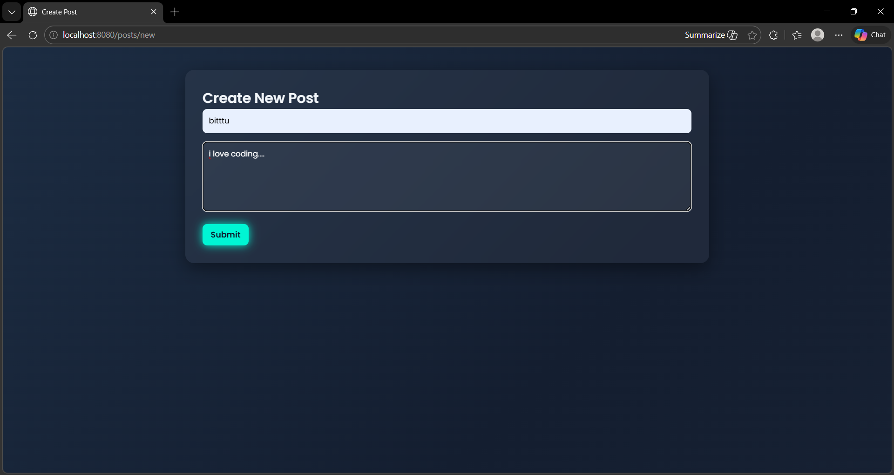
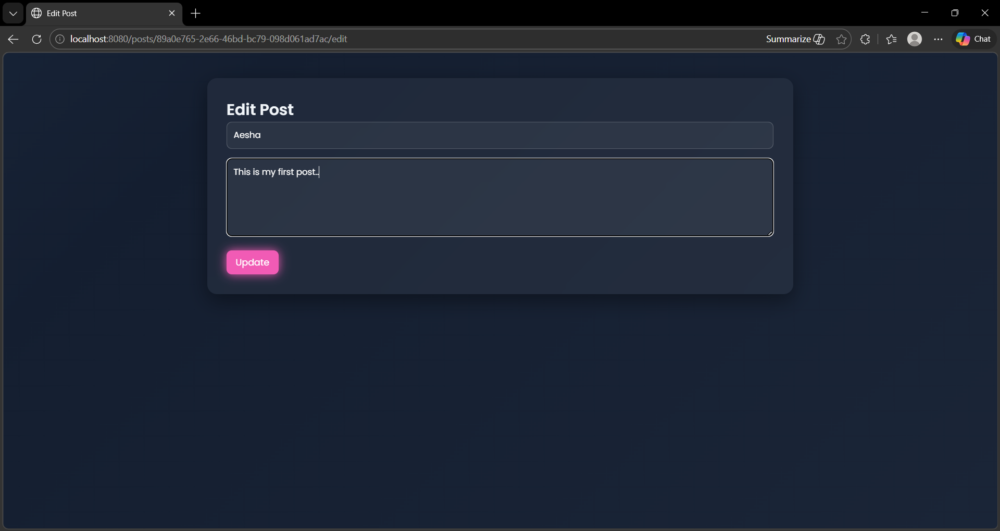
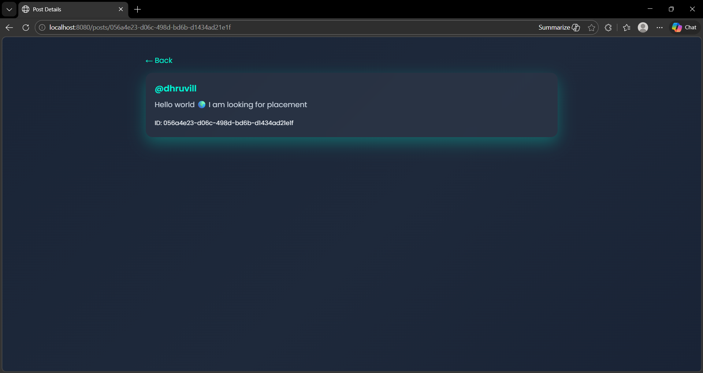

# Quora CRUD App

A web application for creating, editing, and deleting posts with dynamic content management.

## Tech Stack
- Node.js
- Express.js
- EJS
- CSS

## Features
- Create posts
- Edit posts
- Delete posts
- Dynamic routing
- Responsive UI
- Glassmorphism design

## Screenshots

### Home Page

### Create Post

### Edit Post

### View Post

## Project Purpose
This project is built to understand:
- RESTful routing
- CRUD operations
- Backend development
- Template rendering
- Responsive frontend design

## How to Run
1. Clone the repository
2. Install dependencies

Github link=>  https://github.com/Aeshapatel-14/quora-crud-app

3. Start server
4. Open browser

http://localhost:8080/posts
